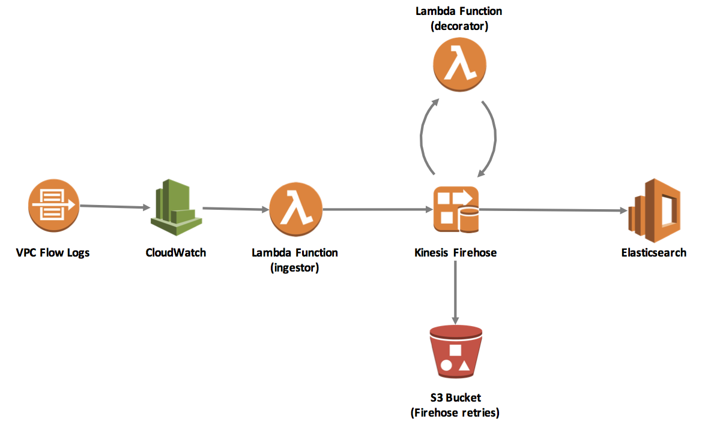

# aws-vpc-flow-log-appender

aws-vpc-flow-log-appender is a sample project that enriches AWS [VPC Flow Log](http://docs.aws.amazon.com/AmazonVPC/latest/UserGuide/flow-logs.html) data with additional information, primarily the Security Groups associated with the instances to which requests are flowing.

This project makes use of several AWS services, including Elasticsearch, Lambda, and Kinesis Firehose.  These **must** be setup and configured in the proper sequence for the sample to work as expected.  Here, we describe deployment of the Lambda components only.  For details on deploying and configuring other services, please see the accompanying [blog post](https://aws.amazon.com/blogs/security/how-to-optimize-and-visualize-your-security-groups/).

The following diagram is a representation of the AWS services and components involved in this sample:




## Getting Started

To get started, clone this repository locally:

```
$ git clone https://github.com/awslabs/aws-vpc-flow-log-appender.git
```

The repository contains [CloudFormation](https://aws.amazon.com/cloudformation/) templates and source code to deploy and run the sample application.

### Prerequisites

To run the vpc-flow-log-appender sample, you will need to:

1. Select an AWS Region into which you will deploy services. Be sure that all required services (AWS Lambda, Amazon Elastisearch Service, AWS CloudWatch, and AWS Kinesis Firehose) are available in the Region you select.
2. Confirm your [installation of the latest AWS CLI](http://docs.aws.amazon.com/cli/latest/userguide/installing.html) (at least version 1.11.21).
3. Confirm the [AWS CLI is properly configured](http://docs.aws.amazon.com/cli/latest/userguide/cli-chap-getting-started.html#cli-quick-configuration) with credentials that have administrator access to your AWS account.
4. [Install Node.js and NPM](https://docs.npmjs.com/getting-started/installing-node).

## Preparing to Deploy Lambda

Before deploying the sample, install several dependencies using NPM:

```
$ cd vpc-flow-log-appender/decorator
$ npm install
$ cd ../ingestor
$ npm install
$ cd ..
```

## Deploy Lambda Functions

The deployment of our AWS resources is managed by a CloudFormation template using AWS Serverless Application Model.

1. Create a new S3 bucket from which to deploy our source code (ensure that the bucket is created in the same AWS Region as your network and services will be deployed):

    ```
    $ aws s3 mb s3://<MY_BUCKET_NAME>
    ```

2. Using the Serverless Application Model, package your source code and serverless stack:

    ```
    $ aws cloudformation package --template-file app-sam.yaml --s3-bucket <MY_BUCKET_NAME> --output-template-file app-sam-output.yaml
    ```

3. Once packaging is complete, deploy the stack:

    ```
    $ aws cloudformation deploy --template-file app-sam-output.yaml --stack-name vpc-flow-log-appender-dev --capabilities CAPABILITY_IAM
    ```

 4. Once we have deployed our Lambda functions, we need to return to CloudWatch and configure VPC Flow Logs to stream the data to the Lambda function. (TODO: add more detail)
    
## Cleaning Up

To clean-up the Lambda functions when you are finished with this sample:

```
$ aws cloudformation delete-stack --stack-name vpc-flow-log-appender-dev
```

## Authors

* **Josh Kahn** - *Initial work*
